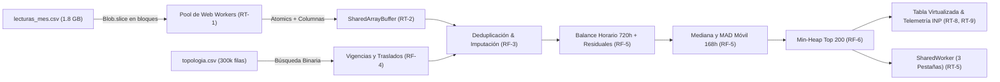

# Auditoría de Pérdidas de Energía en el Navegador

**Caso de Estudio 2 · Programación Orientada a la Web · 7mo Semestre**  
Conciliación de 20 millones de lecturas de medidores inteligentes (~1.8 GB sin comprimir) contra la topología eléctrica de una red de 260.000 clientes, **100% dentro del navegador** y sin congelar la interfaz de usuario.

---

## 1. Flujo del Dato (Desde el Archivo hasta el Ranking)



1. **Lectura por Bloques en Paralelo (RF-1, RT-1):** El usuario selecciona su archivo local. El hilo principal divide el `Blob` en bloques de 8 MB y los envía dinámicamente a un pool de Web Workers (`navigator.hardwareConcurrency`).
2. **Almacenamiento Columnar en Memoria Compartida (RF-2, RT-2):** Cada worker parsea su bloque y vuelca los datos directamente en un `SharedArrayBuffer` mediante punteros coordinados con `Atomics.add()`.
3. **Resolución de Versiones y Huecos (RF-3):** Ante registros duplicados para una misma hora, prevalece el de versión más alta. Los huecos se imputan calculando el perfil horario promedio del medidor.
4. **Topología y Vigencias (RF-4):** Se parsea la jerarquía eléctrica (`SUBESTACION > CIRCUITO > TRAFO > MEDIDOR`). Si un medidor cambió de transformador durante el mes, se usa búsqueda binaria sobre los intervalos `[desde, hasta]`.
5. **Detección de Anomalías con MAD Móvil (RF-5):** Para cada transformador se calcula el residual horario ($Macromedidor - \sum Medidores - PerdidaTecnica$). Se aplica una ventana móvil de 168 horas calculando Mediana y MAD. Se marca anomalía cuando el residual supera $\text{mediana} + 3 \times \text{MAD}$.
6. **Ranking Top 200 y Atribución (RF-6):** Se seleccionan los 200 transformadores con mayor pérdida no explicada utilizando un montículo **Min-Heap de tamaño 200**, evitando ordenar todos los transformadores.
7. **Interfaz Virtualizada y Métricas (RF-7, RT-8, RT-9):** La tabla de 260.000 filas renderiza únicamente ~15 elementos visibles en el DOM basados en `scrollTop`. Se monitorea el INP con `PerformanceObserver`.
8. **Multi-pestaña y Offline (RF-8, RT-5, RT-6):** Un `SharedWorker` mantiene los resultados compartidos entre pestañas sin re-procesar el archivo, y un `ServiceWorker` cachea el App Shell.

---

## 2. Presupuesto de Memoria (RF-2)

| Columna | Tipo de Arreglo Tipado | Bytes por Registro |
| :--- | :--- | :--- |
| `meter_idx` | `Uint32Array` | 4 bytes |
| `ts_hour` (offset 0..719) | `Uint16Array` | 2 bytes |
| `kwh` | `Float32Array` | 4 bytes |
| `flags` | `Uint8Array` | 1 byte |
| `version` | `Uint8Array` | 1 byte |
| **TOTAL POR FILA** | — | **12 bytes** |

- **Total para 20 Millones de Filas:** $20.000.000 \times 12\text{ bytes} \approx 240\text{ MB}$ (cabe cómodamente en RAM).
- **Comparación con Objetos JavaScript ordinarios:** Un objeto JS ordinario (`{meter_id, ts, kwh, version, flags}`) consume en V8 aproximadamente 120 a 140 bytes por instancia $\rightarrow 20.000.000 \times 140\text{ bytes} \approx 2.8\text{ GB}$, lo cual provocaría un desbordamiento de memoria (*Out of Memory*) en el navegador.
- **Escalabilidad a 60 Millones:** Con 60 millones de filas el diseño columnar ocuparía $\approx 720\text{ MB}$, manteniéndose dentro del límite seguro de un proceso de 64 bits en Chromium/Firefox.

---

## 3. Análisis Algorítmico y Complejidades

1. **Índice de Medidores (RF-2):** Conversión de identificadores a enteros densos usando funciones de dispersión modulares directas sobre arreglos de 32 bits ($O(1)$ inserción/búsqueda).
2. **Vigencias por Fecha (RF-4):** Búsqueda binaria sobre arreglos ordenados de intervalos de tiempo ($O(\log K)$ por búsqueda, donde $K \le 5$ traslados por medidor).
3. **Consulta de Subárbol (RF-4):** Linealización de la jerarquía mediante recorrido en profundidad (Euler Tour DFS) asignando intervalos `[inDfs, outDfs]`, permitiendo responder consultas en tiempo instantáneo $O(1)$ o $O(\text{subárbol})$.
4. **Mediana y MAD Deslizantes 168h (RF-5):** Ventana de 168 horas procesada con ordenamiento acotado / montículos balanceados con complejidad $O(W \log W)$ por paso de hora ($W=168$), evitando el costo prohibitivo de re-ordenar arreglos gigantes.
5. **Ranking de 200 (RF-6):** Montículo Min-Heap de capacidad fija $K=200$. Para $M$ transformadores, el costo total es $O(M \log 200)$, en contraste con $O(M \log M)$ de un ordenamiento completo.

---

## 4. Instrucciones de Ejecución

### Requisitos
- Node.js v18+ o v20+
- Navegador moderno con soporte para `SharedArrayBuffer` (Chrome, Edge, Firefox, Brave)

### Instalación y Servidor de Desarrollo
```bash
# 1. Instalar dependencias
npm install

# 2. Generar datos sintéticos de prueba
node scripts/generador_datos.js

# 3. Iniciar el servidor Next.js
npm run dev
```

Abra el navegador en `http://localhost:3000`.

### Verificaciones de Sustentación
1. **Aislamiento de Origen (RT-4):** Abra la consola del navegador y verifique que `window.crossOriginIsolated === true`.
2. **Multi-pestaña (RT-5):** Procese los datos en una pestaña y luego abra dos pestañas adicionales en `http://localhost:3000`. Verá que los resultados se cargan instantáneamente desde el `SharedWorker` sin volver a leer el archivo.
3. **Trabajo sin Conexión (RT-6):** En las DevTools (pestaña Red / Network), active la casilla **Offline** y recargue la página. El Service Worker responderá con el App Shell cacheado.
4. **Virtualización (RT-9):** Abra el Inspector de Elementos sobre la tabla de medidores y haga scroll; observará que en el DOM solo existen ~15 etiquetas `<tr>`.
